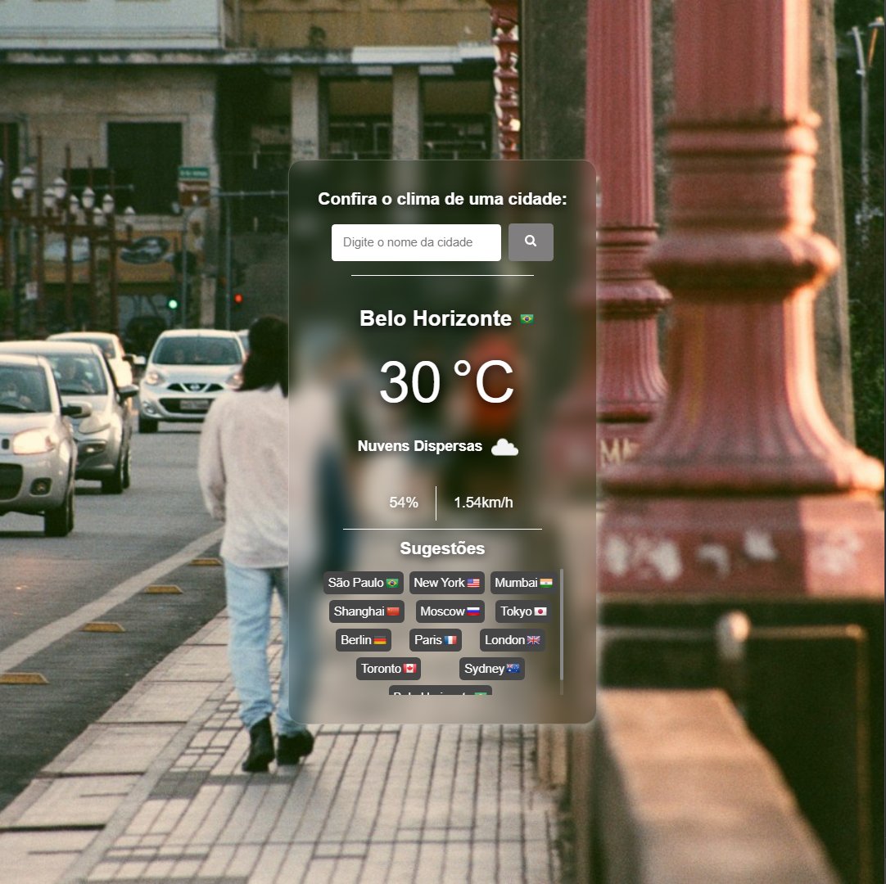
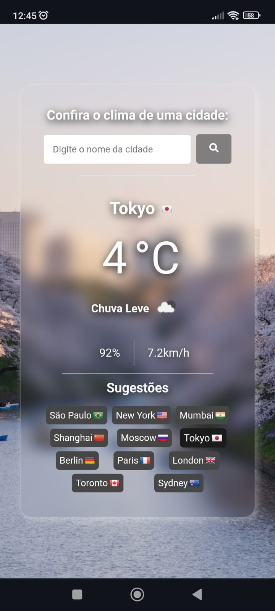

# Aplicativo de Tempo

## Link da aplicação: https://climate-app-nine.vercel.app

### Descrição
Este é um aplicativo simples que fornece informações climáticas de uma cidade. Ele utiliza a API de tempo para obter os dados meteorológicos em tempo real.

### Funcionalidades
- **Pesquisa por Cidade:** Digite o nome da cidade desejada para obter as informações climáticas.
- **Exibição Detalhada:** Veja detalhes como temperatura, umidade, velocidade do vento, etc.
- **Sugestões de Cidades:** Sugestões automáticas de cidades com base nas pesquisas anteriores.

### Como Usar
1. Clone este repositório em seu ambiente local.
2. Instale as dependências usando `npm install`.
3. Execute o aplicativo usando `npm start`.
4. Acesse o aplicativo no navegador no endereço [http://localhost:3000](http://localhost:3000).

### Configuração
- Acesse [https://openweathermap.org/api](https://openweathermap.org/api) para obter uma chave de API gratuita.
- Substitua a chave de API padrão no código pelo seu próprio.

### Tecnologias Utilizadas
-  

- API de Tempo
- API para trocar a imagem https://source.unsplash.com/1600x900/
- API para a bandeira  https://flagsapi.com

### Imagens:

